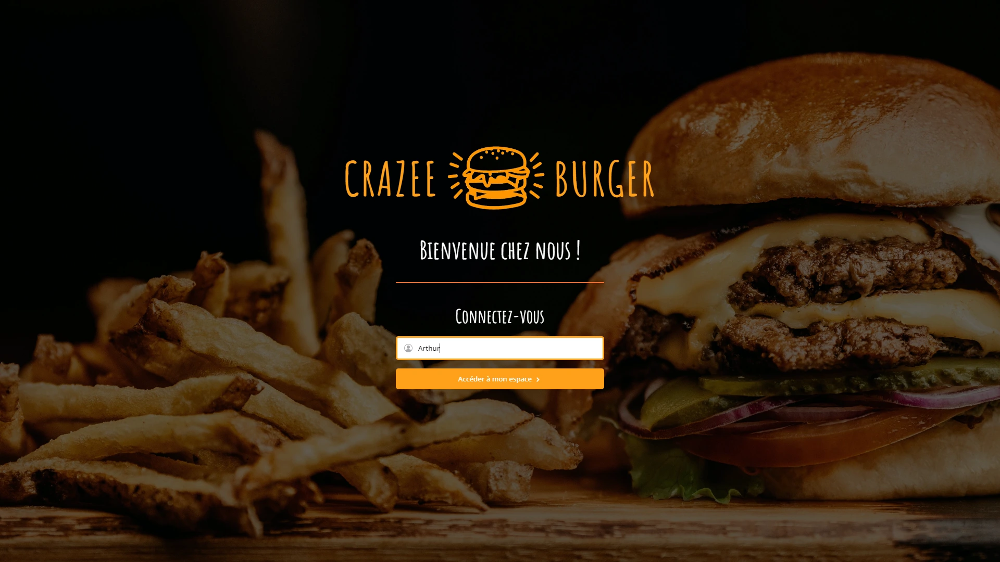
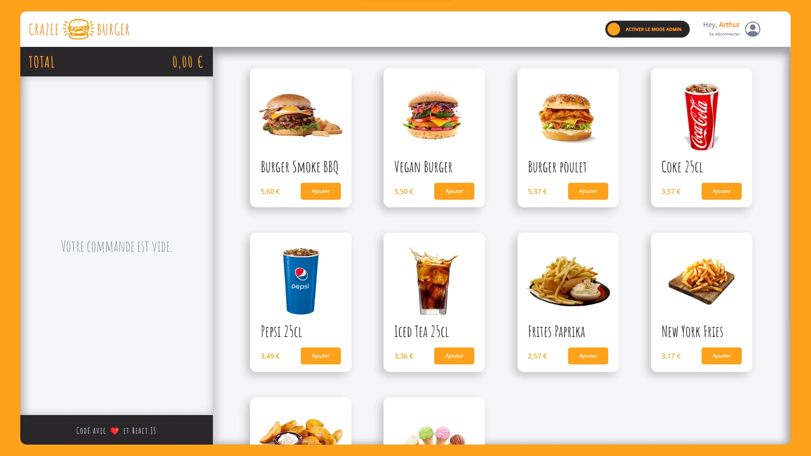
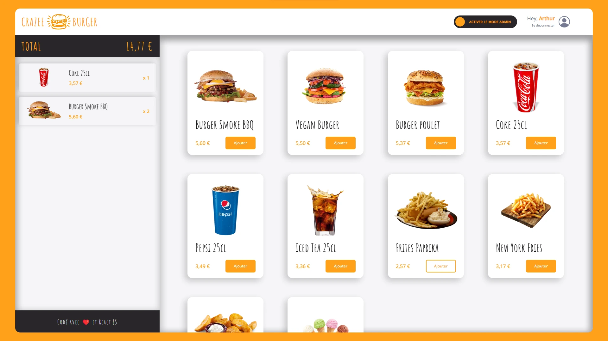
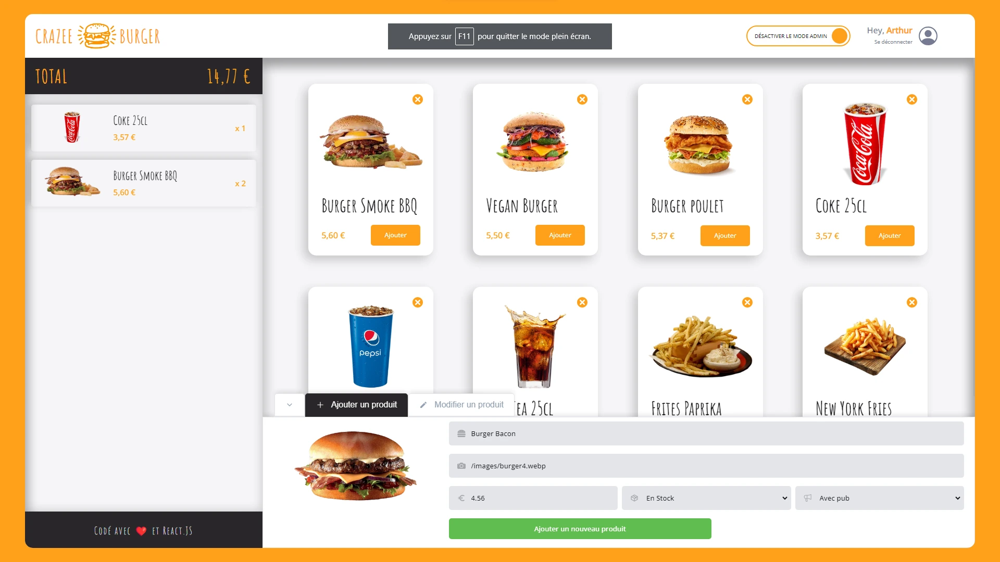
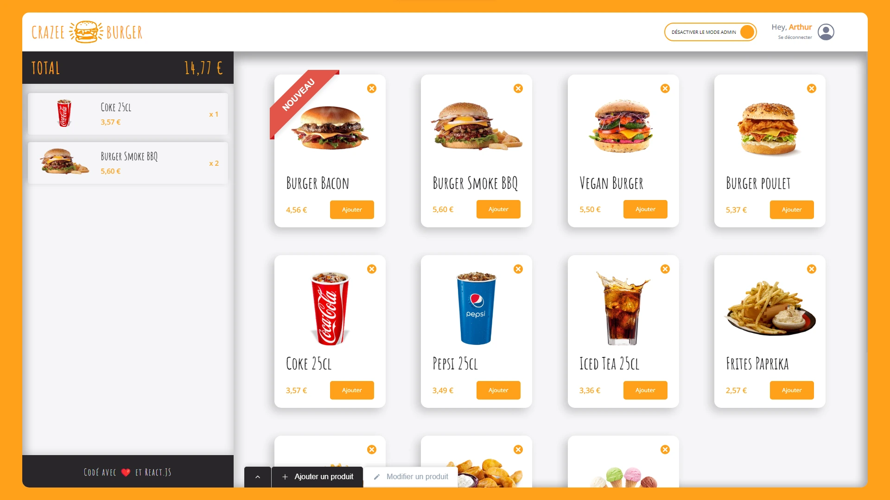
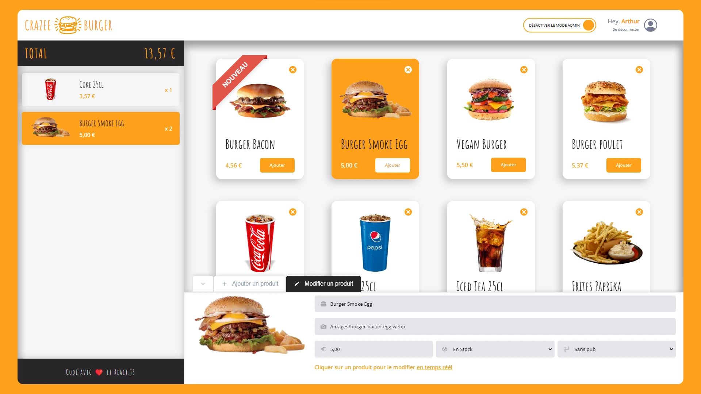
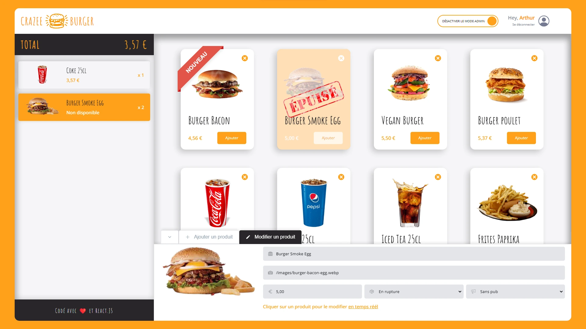
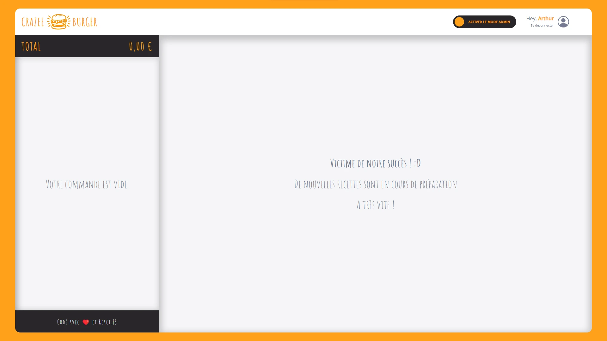
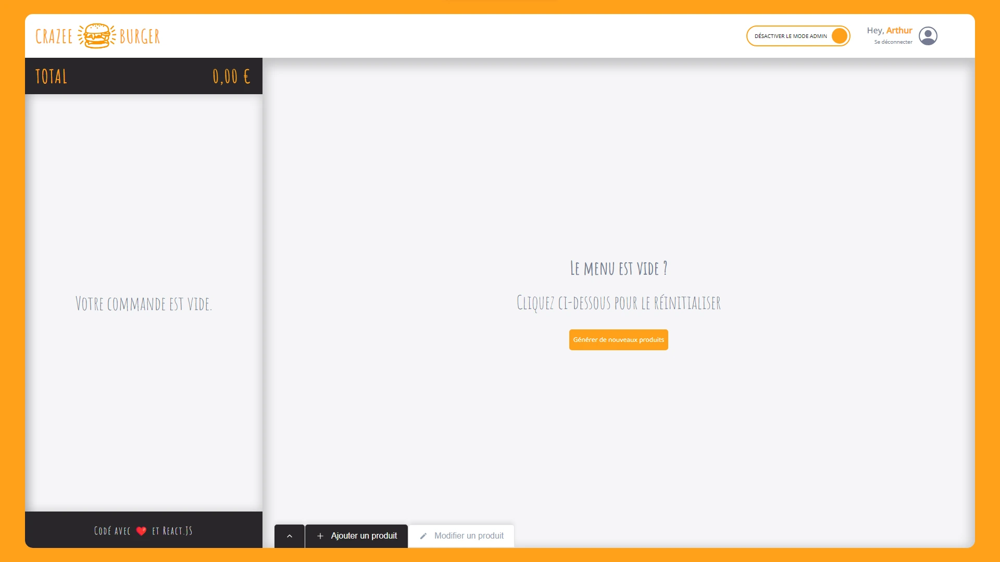

# 🍔 Crazee Burger - L'avenir de la restauration digitale

## 🌟 Présentation
**Crazee Burger** est bien plus qu'une simple plateforme de commande en ligne. Il s'agit de l'intersection entre technologie de pointe et expérience culinaire. Avec notre plateforme, chaque utilisateur a le pouvoir de personnaliser son expérience, que ce soit en choisissant son repas ou en jouant le rôle d'un administrateur pour façonner le menu.

## 🔍 Caractéristiques principales
- **Expérience utilisateur intuitive** : Connectez-vous simplement avec un nom et plongez dans un univers de saveurs.
- **Mode administrateur** : Un outil puissant permettant aux utilisateurs de gérer le menu en temps réel.
- **Temps réel** : Chaque modification est immédiatement reflétée, que ce soit dans le menu ou dans votre panier.

## 🛠 Technologies de pointe
- **React** : La fondation de notre interface utilisateur, garantissant réactivité et performance.
- **Vite** : Optimisation et rapidité de développement garanties.
- **Firebase** : Stockage de données fiable et efficace.
- **Context & Custom Hooks** : Gestion avancée de l'état global pour une expérience utilisateur sans faille.
- **React-Icons** : Intégration d'icônes élégantes pour une UI moderne.
- **Styled-components** : Design personnalisé et adaptatif pour tous les appareils.
- **Framer-motion** : Animations fluides et professionnelles, améliorant l'interaction utilisateur.

## 🚀 Mise en route
1. Clonez le dépôt.
2. Exécutez `npm install` pour installer les dépendances.
3. Lancez avec `npm run dev`.

## 🖥 Compatibilité
Veuillez noter que Crazee Burger est optimisé pour une utilisation sur ordinateur de bureau. Bien que l'application puisse fonctionner sur des appareils mobiles, l'expérience utilisateur n'est pas garantie et peut varier. Pour une expérience optimale, nous recommandons d'utiliser l'application sur un ordinateur de bureau.

## 🎨 Aperçu visuel

    
    
    
    
    
    
    
    
    

## 💼 À propos de l'auteur
- **[Arthur Boron]** : Passionné par le développement web, j'ai conçu Crazee Burger comme une vitrine de mes compétences.

## 📞 Contact
- **Email** : [arthur@boron.fr](mailto:arthur@boron.fr)
- **LinkedIn** : [https://www.linkedin.com/in/arthur-boron/](#)

